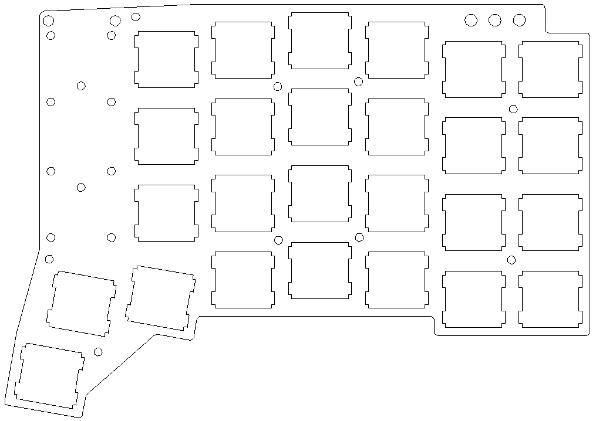

> my end game keyboard... I hope

## What is this thing?
I've been using an ErgoDox as my only keyboard for quite a few years now and I
love it. I may have a need for a more portable keyboard in the future so I've
been exploring keyboards with less keys. There are so many candidates but none
match *exactly* what I want, so why not build my own!

I know the sticking out thumb cluster affects portability a bit but I'm totally
willing to make that tradeoff for a more useful keyboard.

As this will be the first board I've built from scratch, I'll try to piggy back
on existing an QMK keyboard that already has a strong community; I'm thinking
the ergotravel.

## Repo layout
The `master.dxf` file is the source of truth for the switch plate. It contains
both the top and bottom plates (the bottom is a subset of the top). The
`derived-cad` directory contains files that have been *derived* from the
master, as a convenience. And so multiple people don't have to repeat the same
work.

Some CAD cutters want you to put your designs in context of a sheet of their
material so I'm also storing these files as I gather quotes.

## Desgin choices:
  - ErgoDox style ortho-columnar
  - Make all thumb keys easily accessible from the normal hand position
  - keep my vim-style arrows on the right hand
  - same plate design for both halves, achieved with optional switches
  - leverage QMK layout from an existing keyboard if possible. Any 4x7 layout
      is a contender: ergotravel, Ergo42, Runner3680
  - layer status LEDs
  - those large, pink keys are placeholders for the pro micros
  - the thumb keys are rotated the opposite way to what you'd think because
    they pack tighter (make a smaller footprint) and still feel ok
  - minimise overall footprint by using internal standoffs (thanks for the idea
      ergotravel)
  - mounting holes for a SwanMatch Moge Naide Pro Micro socket [photo
      here](./misc/swanmatch-moge-naide.jpg)
      ([link](https://booth.pm/ja/items/1073313)
      [link](https://twitter.com/swan_match/status/1034413919882731521)
      [link](https://www.instagram.com/p/BtsCKRRgETS/)) in either orientation
      so you can either plug directly into your Pro Micro, or mount it reverse
      and wire it to a USB breakout board. This way you can run USB-C via a
      breakout board even if your Pro Micro doesn't support it. Plus, if you
      break a connector, it's only the breakout board.
  - mounting holes for the [SparkFun USB-C breakout
      board](https://github.com/sparkfun/USB-C-Breakout/)

## The switch plate

## FAQ
**Is there a PCB?**
Not yet. I haven't yet learned how to design PCBs yet (still learning the CAD
for the switch plate). Once I've tried the layout with a handwired prototype, I
might tackle the PCB.

**Do you have keyboard-layout-editor source?**
Yes. Either [this file](./keyboard-layout-editor-config.txt) in this repo or here's a (hopefully up to date)
[permalink](http://www.keyboard-layout-editor.com/##@@_y:1&x:3;&=E&_x:8.75;&=I;&@_y:-0.875&x:2;&=W&_x:1;&=R&_x:6.75;&=U&_x:1;&=O;&@_y:-0.875&x:5;&=T&=Esc&_c=#ffebeb&g:true&a:7&w:1.25&h:3;&=&_x:0.25&w:1.25&h:3;&=&_c=#cccccc&g:false&a:4;&=L2&=Y;&@_y:-0.875;&=%7C%0A%5C&=Q&_x:12.75;&=P&=%7D%0A%5D;&@_y:-0.375&x:3;&=D&_x:8.75;&=K;&@_y:-0.875&x:2;&=S&_x:1;&=F&_x:6.75;&=J&_x:1;&=L;&@_y:-0.875&x:5;&=G&_a:7;&=&_x:2.75&a:4;&=%7B%0A%5B&=H;&@_y:-0.875;&=Tab&=A&_x:12.75;&=/:%0A/;&=%22%0A';&@_y:-0.375&x:3;&=C&_x:8.75;&=%3C%0A,;&@_y:-0.875&x:2;&=X&_x:1;&=V&_x:6.75;&=M&_x:1;&=%3E%0A.;&@_y:-0.875&x:5;&=B&=L1&_x:2.75&g:true&a:7;&=&_g:false&a:4;&=N;&@_y:-0.875;&=Shift&=Z&_x:12.75;&=?%0A//&=Shift;&@_y:-0.375&x:3&g:true&a:7;&=&_x:8.75&g:false;&=%E2%86%93;&@_y:-0.875&x:2&a:4;&=Alt&_x:1;&=L5&_x:6.75&a:7;&=%E2%86%90&_x:1;&=%E2%86%91;&@_y:-0.75&a:4;&=Ctrl&=~%0A%60&_x:12.75&a:7;&=%E2%86%92&_a:4;&=Win;&@_r:10&rx:12&ry:4.5&x:-1.25;&=Space;&@_y:-0.75&x:-2.25&a:7;&=;&@_x:-2.25&a:4;&=Enter;&@_r:-10&rx:4.75&x:0.25;&=Bksp;&@_y:-0.75&x:1.25&a:7;&=;&@_x:1.25&a:4;&=Del).
Note that those big pink keys in the middle are placeholders for Pro Micros.
Don't cut a switch hole there.
