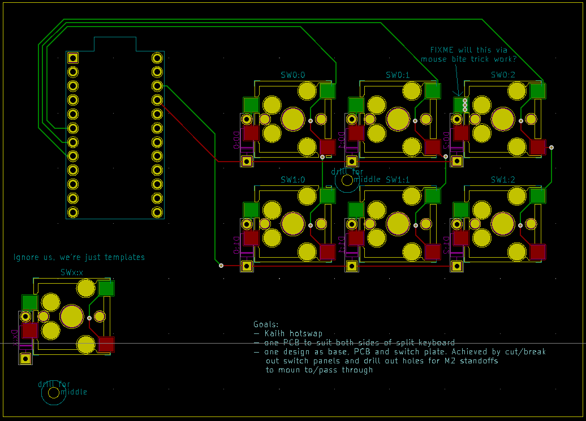
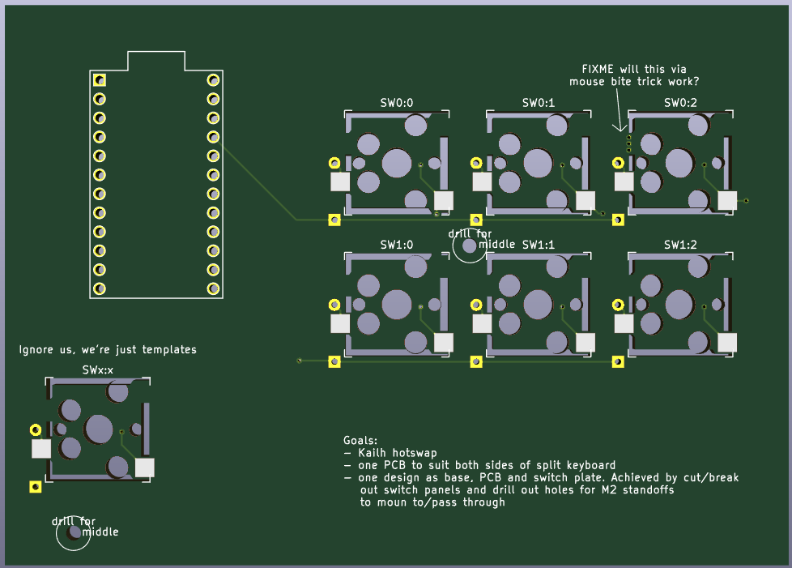
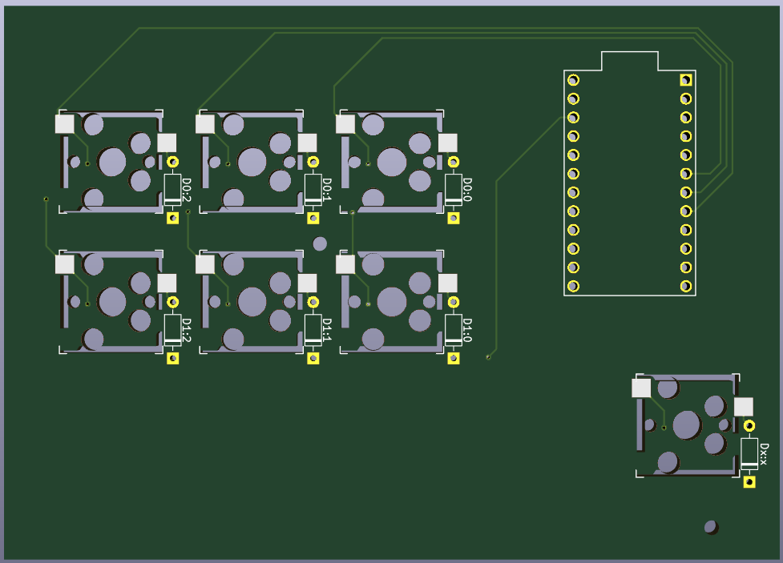

# What is this?
I'm learning about PCB design, so I can make my own mechanical keyboard. This
is a "hello world" project to test my ideas/goals.

# Goals
- Support for Kailh hotswap sockets (and kailh choc as solder on)
- add thumb keys, actually all keys, are accessible from the "home" hand
    position
- One PCB design that works as all 3 layers of a sandwich design: base, PCB and
    switch plate. Idea taken from [for-split-keyboard](https://github.com/peej/for-split-keyboard)
- a design that can be used for either side of a split keyboard
- support 5 pin switches
- single socket for ProMicro. Just mount it flipped for other side
- through-hole diodes, because they're easier to solder
- no RGB because there's no room and it's not my thing

# TODO
- make the ProMicro section snap-off for top layer. Although, we only need it
    for the OLED so we could have a small snapout window for that and then LEDs
    and reset "just work".
- do we mount the promicro on the top or bottom of the PCB? Top works if we
    have snapoff section but if we don't, we need to use the bottom so we can
    access it
- make the bottom row, where the choc switches go, snap-off so they can use the
    switch plate and still reach the PCB. The bonus is that they'll mount lower
    and get out the way of the next row. MX are 5mm deep, choc are 2.35mm so
    the choc row should drop by 2.65mm. The top of the choc switches will be
    ~5mm above the top of the switchplate for the MX switches.
- do we *need* that blank space for thumbs to rest?
- should we support the switch plate or just leave it floating? The bottom of
    the switches will be better at supporting keypresses than the switch plate
    so the plate is just for alignment. We need 3.5mm spacers (for MX switches)
    if we choose to attach the switch plate to the pcb.
- make hole to reach reset button if it's not on the snapoff section
- add OLED? (and pull up resistors)
- make sure the ProMicro is set back enough that you could permanently plug a
    flying-lead plug into it (to go to a USB-C breakout board) and not have it
    vulnerable.
- LEDs:
  - do I need resistors? Yes. At full brightness: 82 - 100ohm for blue, green or white; and 150 - 180ohms for red or yellow
  - add layer status LED footprints
  - can we cut 3mm mounting holes just to the side of the pads and bend the
      LED legs to reach the pads. Means less drilling for us. These need to be
      on the main section, not the snapoff
  - make sure we don't exceed max current for pin groups (100mA). I don't think
      the switches use much current so we should be ok
  - can I drive 3 LEDs with only two pins?
  - can I use a short (3 LEDs) WS2812B strip on the top for layer status?
      The issue is that the OLED uses I2C and (I'm assuming) the LED strip does
      too so if we can have separate code on the master and the slave, we can
      have OLED on one side and layer status on the other. Maybe even just one
      LED as we have lots of different colours.
  - pulling from previous item: do WS2812B strips use I2C or can we drive it
      from any old pin on the PM?
- look at copying how Lily58 lays out the promicro area: https://github.com/kata0510/Lily58
- add solder pads for missing switches, and diodes, so people can make external mounts and
    use them
- add fuses/overcurrent/reverse polarity protection for TRRS? Not sure what
    that coupler solder pad setup on the helix is for
- add licence to repo and silk screen
- add ICSP headers
- add other test points (VCC, RAW, etc)
- do I have the right diode (and footprint)?
- add build instructions to silk screen
- add holes for acrylic cover over oled
- are the PTH for the choc switches going to be a problem as they're over the
    solder on pads for the 1511 socket?
- layout keys as columnar staggered: 0, +1/4 (4.75mm), +3/8 (7.125mm), +1/4 (4.75mm), +1/8 (2.375mm)
- is the ARM CPU in the Ergodox Infinity the same as the Proton-C? If so, can
    we use that firmware to get split support for a controller with more flash?
- name the board as lilydox? Maybe with a chicken silk screen?
- look at adding separate mounting holes for the switch plate to the pcb. Might
    be able to use bolt and nut and some M2 x 5 x 0.3mm nylon washers. The thin
    washer should give us enough granularity to get the right height. Something
    like [these](http://www.allfastsolutions.com.au/product/40868-nylon-flat-washer-m2-x-5-x-0-3mm).

# Images

# Parts
- 2x PJ-3200B-4A [link](https://lcsc.com/product-detail/Audio-Video-Connectors_Korean-Hroparts-Elec-PJ-3200B-4A_C136687.html) (PJ-320A is discontinued)

# Credit for Kicad symbols/footprints
- [Kailh reversible footprint](https://github.com/daprice/keyswitches.pretty/blob/master/Kailh_socket_reversible.kicad_mod)
- [P-08073 TACT reset switch footprint](https://github.com/kata0510/minisplit/tree/master/minisplit-footprint.pretty)
- [TRRS jack symbol](https://github.com/MakotoKurauchi/helix/tree/master/PCB/beta) (exported from schematic)
- [TRRS footprint](https://github.com/keebio/Keebio-Parts.pretty/blob/master/TRRS-PJ-320A-dual.kicad_mod)
- [LED symbol](https://github.com/tmk/kicad_lib_tmk)
- LED and diode footprints from built in Kicad library
- [footprints: 4 pin TACT reset, promicro, diode](https://github.com/jpconstantineau/ErgoTravel/tree/master/Library/footprints.pretty)

